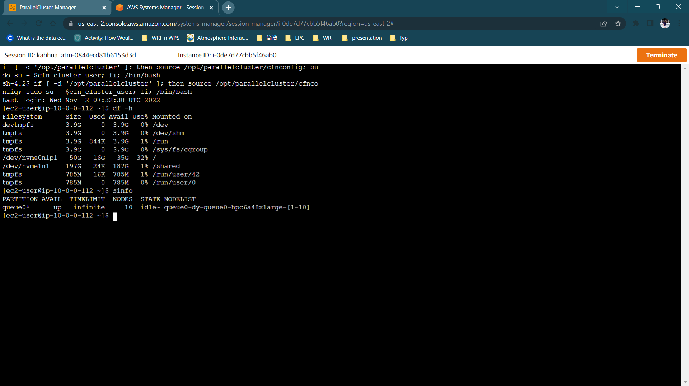
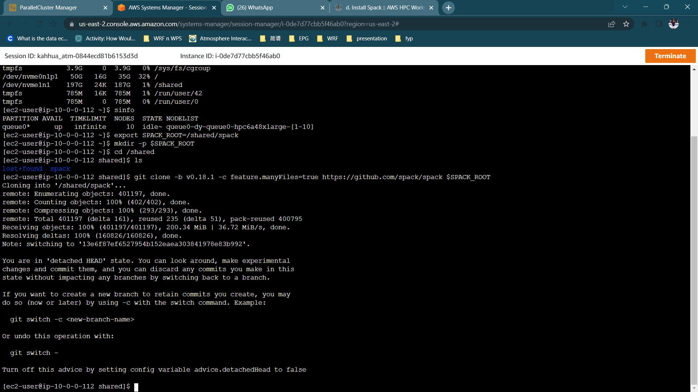

<!--- 

[atmosfera website](https://atmosfera.usm.my/)

**Bold Text** 

> following points:
- list
- list

{--deleted--}
{++added++}
{~~one~>a single~~}
{==Highlighting==}
{>>and comments can be added inline<<}
---> 

# Spack Installation

## **Verify the Cluster**

    df -h

--

    sinfo



## **Spack Installation**

Download Spack

    export SPACK_ROOT=/shared/spack
    mkdir -p $SPACK_ROOT
    git clone -b v0.18.0 -c feature.manyFiles=true https://github.com/spack/spack $SPACK_ROOT



Define .bashrc file

    echo "export SPACK_ROOT=/shared/spack" >> $HOME/.bashrc
    echo "source \$SPACK_ROOT/share/spack/setup-env.sh" >> $HOME/.bashrc
    source $HOME/.bashrc

Spack Version

    spack -V

0.18.1 (13e6187e£65279546152eaea303841978e836992)

**Patchelf Installation**

--

    spack install patchelf

-- 

    spack find 
    spack load patchelf
    which patchelf

Spack build cache

    pip3 install botocore==1.23.46 boto3==1.20.46

Add the mirror to the binary cache

    spack mirror add aws-hpc-weather s3://aws-hpc-weather/spack/
    spack buildcache keys --install --trust --force    

Adding parallel cluster's softwares to the Spack

```
cat << EOF > $SPACK_ROOT/etc/spack/packages.yaml
packages:
    libfabric:
        variants: fabrics=efa,tcp,udp,sockets,verbs,shm,mrail,rxd,rxm
        externals:
        - spec: libfabric@1.13.2 fabrics=efa,tcp,udp,sockets,verbs,shm,mrail,rxd,rxm
          prefix: /opt/amazon/efa
        buildable: False
EOF
```