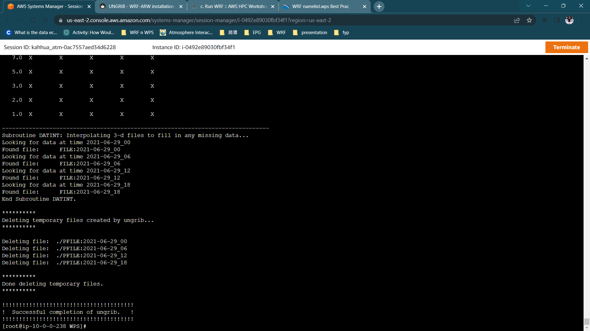

# UNGRIB 

Create GFS data under `/WRF_Resources` that you just created. 

    cd /shared/scratch/WRF_Resources
    mkdir GFS_Data
    cd GFS_Data

Before you start using the python script, check the website [Research Data Archive website](https://rda.ucar.edu/datasets/ds084.1/index.html){target=_blank} to see if the data sets for your interested dates are available. Create a python script to download the GFS Data. Make necessary changes on the dates and hours.This python script downloads 4 data on 20210629 with 6 hours interval. Fill in `YOUR EMAIL` (line 47) to avoid bad authentication. The alternatives would be download the python script and upload through DCV.

``` py linenums="1" hl_lines="47" title="download_20210629.py"
cat <<EOF > download_20210629.py
#!/usr/bin/env python
#################################################################
# Python Script to retrieve 4 online Data files of 'ds084.1',
# total 2.06G. This script uses 'requests' to download data.
#
# Highlight this script by Select All, Copy and Paste it into a file;
# make the file executable and run it on command line.
#
# You need pass in your password as a parameter to execute
# this script; or you can set an environment variable RDAPSWD
# if your Operating System supports it.
#
# Contact rdahelp@ucar.edu (RDA help desk) for further assistance.
#################################################################


import sys, os
import requests

def check_file_status(filepath, filesize):
    sys.stdout.write('\r')
    sys.stdout.flush()
    size = int(os.stat(filepath).st_size)
    percent_complete = (size/filesize)*100
    sys.stdout.write('%.3f %s' % (percent_complete, '% Completed'))
    sys.stdout.flush()

# Try to get password
if len(sys.argv) < 2 and not 'RDAPSWD' in os.environ:
    try:
        import getpass
        input = getpass.getpass
    except:
        try:
            input = raw_input
        except:
            pass
    pswd = input('Password: ')
else:
    try:
        pswd = sys.argv[1]
    except:
        pswd = os.environ['RDAPSWD']

url = 'https://rda.ucar.edu/cgi-bin/login'
values = {'email' : 'YOUR EMAIL', 'passwd' : pswd, 'action' : 'login'}
# Authenticate
ret = requests.post(url,data=values)
if ret.status_code != 200:
    print('Bad Authentication')
    print(ret.text)
    exit(1)
dspath = 'https://rda.ucar.edu/data/ds084.1/'
filelist = [
'2021/20210629/gfs.0p25.2021062900.f000.grib2',
'2021/20210629/gfs.0p25.2021062906.f000.grib2',
'2021/20210629/gfs.0p25.2021062912.f000.grib2',
'2021/20210629/gfs.0p25.2021062918.f000.grib2']
for file in filelist:
    filename=dspath+file
    file_base = os.path.basename(file)
    print('Downloading',file_base)
    req = requests.get(filename, cookies = ret.cookies, allow_redirects=True, stream=True)
    filesize = int(req.headers['Content-length'])
    with open(file_base, 'wb') as outfile:
        chunk_size=1048576
        for chunk in req.iter_content(chunk_size=chunk_size):
            outfile.write(chunk)
            if chunk_size < filesize:
                check_file_status(file_base, filesize)
    check_file_status(file_base, filesize)
    print()
EOF
```


Execute the python script to download the data. You must be a registered user on the NCAR website because you will be asked for password before the permission to download the data is granted.

    pip3 install requests    
    python3 download_20210629.py


Obtain the path to your GFS_Data where in this case, it is `/shared/scratch/WPS`. Go back to the directory where your WPS is compiled and create the symbolic link to the GFS data that you just downloaded. You should expect four GRIBFILE with same prefix but different labels behind, AAA, AAB, AAC and AAD.


    cd /shared/scratch/WPS
    ./link_grib.csh /shared/scratch/WPS/WRF_Resources/GFS_Data/gfs.*


Create the symbolic link to the Vtable.

    ln -sf ungrib/Variable_Tables/Vtable.GFS Vtable
    ls -alh


Now, it is time to edit the `namelist.wps`. Below are the few things that should be amended according to the GFS data. 

- start date 
- end date 
- the interval seconds that desribe the interval between your GFS data

```
nano namelist.wps
```

Increase your stack limit as the superuser.

    sudo -s
    ulimit -s unlimited

Export the library path.

    export LD_LIBRARY_PATH=/shared/spack/opt/spack/linux-amzn2-zen2/intel-2021.5.0/jasper-2.0.31-skcu73p6hnlgov6teechaq6muly2xrez/lib64/:\$LD_LIBRARY_PATH


Run the ungrib.

    ./ungrib.exe


You will see the successful output printed out at the completion of ungrib.exe and four output with prefix FILE are created.




Remember to exit the superuser by typing exit.

    exit